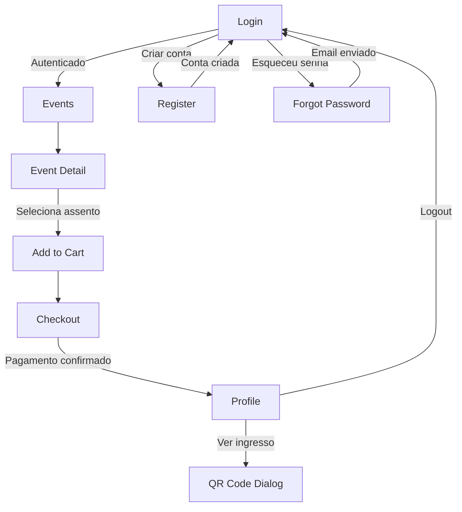

# 📚 Documentação Técnica - TicketMaster IFMG

## 🎯 Visão Geral da Arquitetura

### Padrão Arquitetural

O projeto utiliza uma **arquitetura baseada em componentes** com **separação de responsabilidades**:

```
┌─────────────────────────────────────────────────────────┐
│                    CAMADA DE APRESENTAÇÃO                │
│  (Components - Login, Events, EventDetail, Checkout...) │
└────────────────────┬────────────────────────────────────┘
                     │
┌────────────────────▼────────────────────────────────────┐
│                    CAMADA DE SERVIÇOS                    │
│           (AuthService, DataService, Guards)            │
└────────────────────┬────────────────────────────────────┘
                     │
┌────────────────────▼────────────────────────────────────┐
│                    CAMADA DE MODELOS                     │
│        (User, Event, Ticket, Category, Seat)            │
└────────────────────┬────────────────────────────────────┘
                     │
┌────────────────────▼────────────────────────────────────┐
│                  CAMADA DE PERSISTÊNCIA                  │
│              (LocalStorage - Dados Simulados)            │
└─────────────────────────────────────────────────────────┘
```

---

## 🔄 Fluxo de Navegação



---

## 📦 Estrutura de Dados

### Usuário (User)

```typescript
interface User {
  id: number;           // Identificador único
  name: string;         // Nome completo
  email: string;        // E-mail (login)
  password: string;     // Senha (hash em produção)
}
```

### Evento (Event)

```typescript
interface Event {
  id: number;                    // Identificador único
  titulo: string;                // Nome do evento
  data: string;                  // Data/hora ISO 8601
  local: string;                 // Local do evento
  descricao: string;             // Descrição completa
  imagem: string;                // URL da imagem
  categoria: string;             // Categoria principal
  categorias: Category[];        // Categorias de ingresso
  mapaAssentos: (Seat | null)[][]; // Matriz de assentos
}
```

### Assento (Seat)

```typescript
interface Seat {
  label: string;         // Identificador (ex: "A1")
  row: number;           // Índice da linha
  col: number;           // Índice da coluna
  disponivel: boolean;   // Status de disponibilidade
  categoriaId: string;   // ID da categoria (std/vip)
  selected: boolean;     // Estado de seleção
}
```

### Ingresso (Ticket)

```typescript
interface Ticket {
  idCompra: string;      // ID único da compra
  eventoId: number;      // Referência ao evento
  eventoTitulo: string;  // Título do evento
  eventoData: string;    // Data do evento
  eventoLocal: string;   // Local do evento
  categoria: string;     // Categoria comprada
  assento: string;       // Assento selecionado
  preco: number;         // Valor pago
  dataCompra: string;     // Data da compra
  qrCode: string;        // Dados para QR Code
  usuarioId: number;     // ID do comprador
}
```

---

## 🔐 Sistema de Autenticação

### AuthService

**Responsabilidades:**
- Gerenciar estado de autenticação
- Realizar login/logout
- Cadastrar novos usuários
- Recuperar senha (simulado)

**Métodos Públicos:**

```typescript
class AuthService {
  // Login do usuário
  login(email: string, password: string): boolean
  
  // Logout do usuário
  logout(): void
  
  // Cadastro de novo usuário
  register(name: string, email: string, password: string): boolean
  
  // Recuperação de senha (simulada)
  forgotPassword(email: string): boolean
  
  // Verificar se está logado
  isLoggedIn(): boolean
  
  // Obter usuário atual
  currentUser(): User | null
}
```

**Persistência:**
- Dados salvos em `localStorage`
- Chave: `currentUser`
- Sessão mantida entre recarregamentos

---

## 📊 Sistema de Dados

### DataService

**Responsabilidades:**
- Gerenciar eventos disponíveis
- Controlar carrinho de compras
- Processar compras
- Gerenciar ingressos do usuário
- Atualizar disponibilidade de assentos

**Métodos Públicos:**

```typescript
class DataService {
  // Eventos
  getEvents(): Event[]
  getEventById(id: number): Event | undefined
  getUpcomingEvents(): Event[]
  getPastEvents(): Event[]
  
  // Carrinho
  addToCart(item: CartItem): void
  removeFromCart(index: number): void
  getCart(): CartItem[]
  clearCart(): void
  getCartTotal(): number
  
  // Ingressos
  getUserTickets(): Ticket[]
  purchaseTickets(): Ticket[]
}
```

---

## 🎨 Design System

### Tokens de Design

```scss
// Cores
--primary: #6750A4;          // Violet - Ações principais
--primary-container: #EADDFF; // Violet claro - Fundos
--secondary: #625B71;        // Gray - Texto secundário
--surface: #FEF7FF;          // Background principal
--error: #B3261E;            // Vermelho - Erros
--success: #2E7D32;          // Verde - Sucesso

// Elevação
--shadow-1: 0 1px 3px rgba(0,0,0,0.12);
--shadow-2: 0 3px 6px rgba(0,0,0,0.15);
--shadow-3: 0 10px 20px rgba(0,0,0,0.15);

// Bordas
--radius-sm: 4px;
--radius-md: 8px;
--radius-lg: 12px;
--radius-xl: 16px;
--radius-full: 9999px;
```

### Componentes Customizados

#### Seat (Assento)
- **Estados**: disponível, selecionado, ocupado
- **Categorias**: Standard, VIP (borda dourada)
- **Interação**: Hover, Click, Disabled

#### Event Card
- **Layout**: Imagem + Título + Data + Local
- **Hover**: Elevação aumentada
- **Click**: Navegação para detalhes

#### Ticket Digital
- **Visual**: Gradiente violeta + padrão decorativo
- **QR Code**: Gerado dinamicamente
- **Informações**: Evento, data, local, assento, categoria

---

## 🧪 Cenários de Teste

### Autenticação

| Cenário | Entrada | Resultado Esperado |
|---------|---------|-------------------|
| Login válido | admin@admin.com / admin123 | Redireciona para eventos |
| Login inválido | email@invalido.com / senha | Mensagem de erro |
| Cadastro novo | Nome, email, senha válidos | Conta criada, redireciona |
| Senha fraca | senha com < 6 caracteres | Validação impede envio |

### Eventos

| Cenário | Ação | Resultado Esperado |
|---------|------|-------------------|
| Listar eventos | Acessar /events | Cards ordenados por data |
| Ver detalhes | Clicar em evento | Página com mapa de assentos |
| Evento passado | Data < hoje | Aparece em "Passados" |

### Compra

| Cenário | Ação | Resultado Esperado |
|---------|------|-------------------|
| Selecionar assento | Clicar em assento disponível | Assento destacado |
| Assento ocupado | Clicar em assento ocupado | Nada acontece |
| Finalizar compra | Preencher cartão e confirmar | Ingresso gerado |
| Ver ingresso | Clicar em "Ver Ingresso" | Dialog com QR Code |

---

## 📱 Responsividade

### Breakpoints

```scss
// Mobile First
@media (max-width: 599px) {
  // Smartphone
  .events-grid { grid-template-columns: 1fr; }
  .seat { width: 32px; height: 32px; }
}

@media (min-width: 600px) and (max-width: 959px) {
  // Tablet
  .events-grid { grid-template-columns: repeat(2, 1fr); }
}

@media (min-width: 960px) {
  // Desktop
  .events-grid { grid-template-columns: repeat(3, 1fr); }
}
```

---

## 🔒 Segurança

### Validações Implementadas

1. **Formulários**
   - Campos obrigatórios
   - Validação de e-mail (regex)
   - Tamanho mínimo de senha
   - Confirmação de senha

2. **Rotas**
   - Guard de autenticação
   - Redirecionamento para login

3. **Dados**
   - Sanitização de inputs
   - Validação de tipos TypeScript

### Em Produção (Recomendado)

- Hash de senhas (bcrypt)
- JWT para autenticação
- HTTPS obrigatório
- Rate limiting
- Validação server-side

---

## 🚀 Performance

### Otimizações Aplicadas

1. **Lazy Loading**
   - Componentes carregados sob demanda
   - Reduz bundle inicial

2. **OnPush Strategy**
   - Change detection otimizado
   - Menos verificações desnecessárias

3. **TrackBy em ngFor**
   - Reutilização de DOM
   - Renderização eficiente

4. **Async Pipe**
   - Gerenciamento automático de subscriptions
   - Previne memory leaks

---

## 📊 Métricas de Usabilidade

### Heurísticas de Nielsen - Checklist

- [x] **H1**: Visibilidade do status do sistema
- [x] **H2**: Correspondência entre sistema e mundo real
- [x] **H3**: Controle e liberdade do usuário
- [x] **H4**: Consistência e padrões
- [x] **H5**: Prevenção de erros
- [x] **H6**: Reconhecimento ao invés de lembrança
- [x] **H7**: Flexibilidade e eficiência de uso
- [x] **H8**: Estética e design minimalista
- [x] **H9**: Ajuda usuários a reconhecer e recuperar erros
- [x] **H10**: Ajuda e documentação

### WCAG 2.1 - Conformidade AA

- [x] Contraste de cores mínimo 4.5:1
- [x] Foco visível em todos elementos interativos
- [x] Labels associados a campos de formulário
- [x] Navegação por teclado completa
- [x] Skip links para conteúdo principal
- [x] Semântica HTML5 correta

---

## 🔧 Manutenção

### Comandos Úteis

```bash
# Desenvolvimento
ng serve                    # Servidor dev (porta 4200)
ng serve --port 4300        # Porta customizada

# Build
ng build                    # Build desenvolvimento
ng build --configuration production  # Build produção

# Testes
ng test                     # Testes unitários
ng e2e                      # Testes end-to-end

# Código
ng generate component nome  # Novo componente
ng generate service nome    # Novo serviço
ng lint                     # Análise de código
```

### Estrutura de Commits (Sugerido)

```
feat: adiciona componente de checkout
fix: corrige validação de email
docs: atualiza documentação
style: ajusta espaçamento do card
refactor: reorganiza serviços
test: adiciona testes do auth service
chore: atualiza dependências
```

---

## 📞 Suporte

### Problemas Comuns

| Problema | Solução |
|----------|---------|
| Tela branca | Verificar console do navegador |
| Login não funciona | Limpar localStorage |
| Assentos não carregam | Verificar se evento existe |
| QR Code não aparece | Verificar dependência qrcode |

### Debug

```typescript
// Habilitar logs no console
localStorage.setItem('debug', 'true');

// Ver dados salvos
console.log(localStorage.getItem('currentUser'));
console.log(localStorage.getItem('events'));
console.log(localStorage.getItem('tickets'));
```

---

**Última atualização**: Maio 2026
**Versão**: 1.0.0
